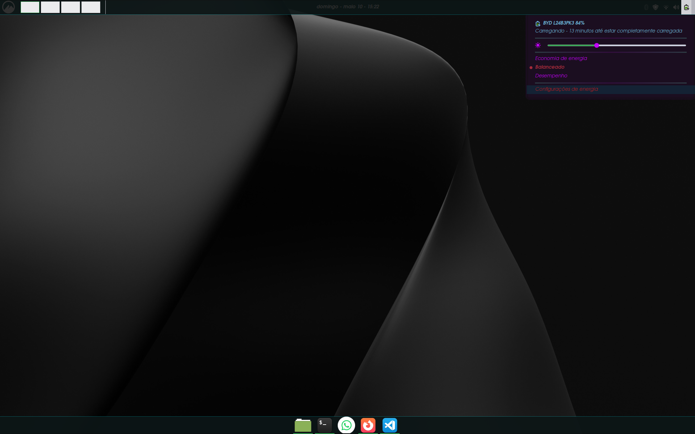

# Noctyra

Tema personalizado para Linux Mint Cinnamon inspirado em estética cyberpunk e gótica.

O objetivo do projeto é aprender personalização de temas no Cinnamon, CSS, Git/GitHub e desenvolvimento de identidade visual para desktop Linux.

---

## ✨ Características atuais

- Painel customizado
- Menu personalizado
- Submenus refinados
- Paleta neon ciano/roxo
- Transparência suave para uso noturno

---

## 📦 Instalação

Copie a pasta do tema para:

```bash
~/.themes
```

Depois selecione o tema nas configurações do Cinnamon.

---

## 🚧 Desenvolvimento Atual

### Antes


### Desktop (Preview)


### Menu principal


### Submenu refinado


---

## 📌 Roadmap

- [x] Personalização do painel
- [x] Primeira versão do menu
- [x] Refinamento visual do submenu
- [ ] Ajustes globais de GTK
- [ ] Melhorias em notificações e popups
- [ ] Ícones personalizados
- [ ] Refinamento visual geral

---

## 🛠 Ferramentas usadas

- Linux Mint Cinnamon
- Visual Studio Code
- Git e GitHub
- CSS
- Bash/Linux Terminal

---

## 🎨 Conceito visual

Noctyra mistura estética gótica e cyberpunk utilizando tons escuros, transparência suave e detalhes neon em roxo e ciano.

O projeto busca conforto visual para uso noturno sem perder identidade visual forte.
