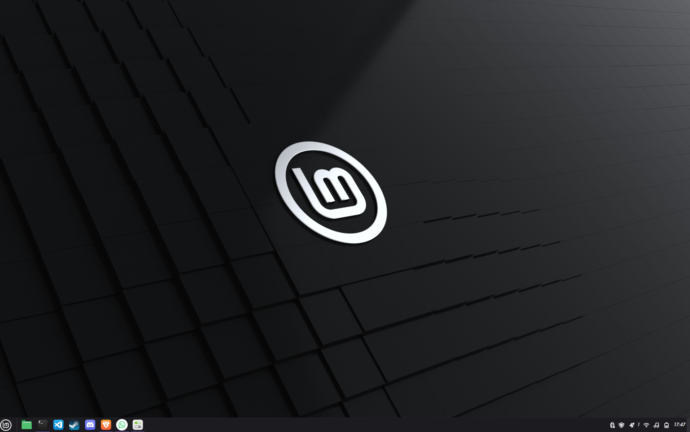
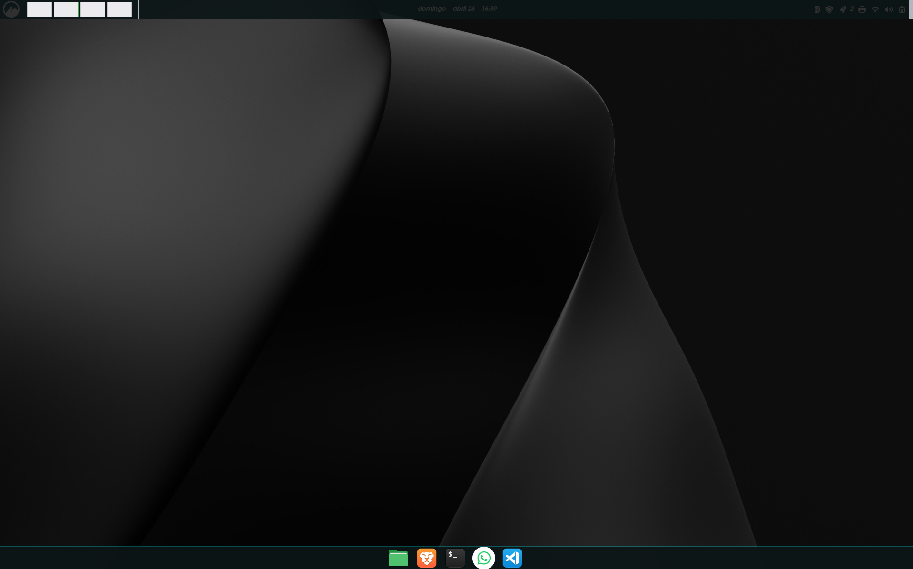
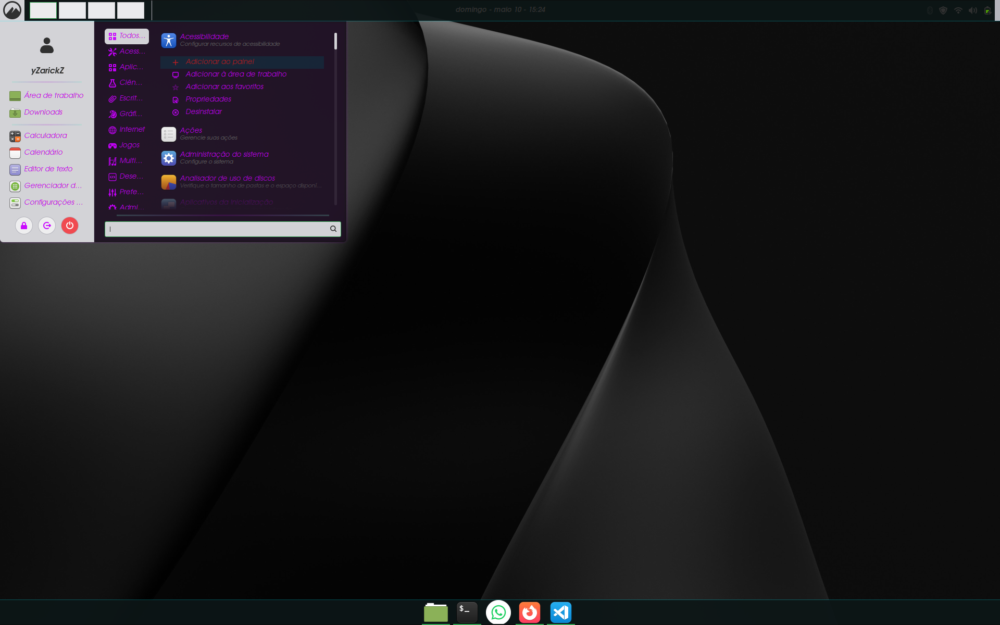

#  Noctyra

Tema personalizado para Linux Mint Cinnamon.

## Objetivo
Aprender personalização de temas e CSS no Cinnamon

## Progresso

- Painel customizado
- Menu em desenvolvimento

## Instalação
Copie para ~/.themes

## 🚧 Desenvolvimento Atual

### Antes

### Desktop (Preview)

### Menu (em desenvolvimento)

